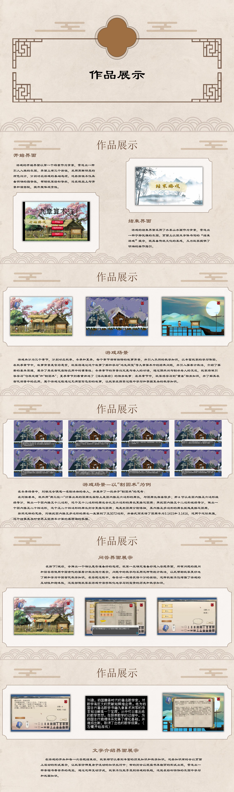

# 从《九章算术》到《九章算术注》—— 假如你是刘徽

## 项目简介

本游戏从刘徽的视角出发，复现其刻苦探索数学的过程以及在生活中应用数学知识帮助百姓解决问题。通过将数学与日常生活的结合，本游戏集合了古代数学智慧的精髓，完善了《九章算术》的不足，最终帮助刘徽完成了《九章算术注》这一传奇著作。游戏中的数学问题和各类证明，如勾股定理、割圆术等，均来源于书籍中的真实内容。

本作品旨在让玩家见证古代数学的传承过程和其辉煌过往，同时学习古代数学的实用性思想。玩家将深刻认识到中国古代传统数学源于生活、注重实际应用的特点，以及算理蕴含于算法中的深刻内涵。本游戏展示了数学不仅仅是单调冰冷的符号，而是古代无数数学家上百年传承的智慧汇集，是维系中国发展到今天的重要基石之一。

## 文件结构说明

- **docs\From_Jiuzhang_to_JiuzhangZhu-As_LiuHui.pdf** : 本项目的详细文档。
- **project**：包含游戏的可执行文件。下载后解压，进入文件夹点击 `anti.exe` 开始游戏。

## 开始游戏

1. 打开 `project` 文件夹。
2. 双击 `anti.exe` 启动游戏。

欢迎踏入这一探索古代智慧和传统数学的旅程，体验数学的无限魅力！

## 作品展示

